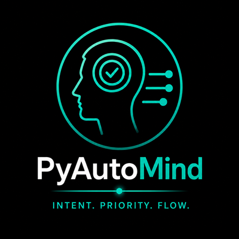

  

# PyAutoMind

 

**PyAutoMind is the Mind of the PyAutoScientist** — where you tell your
scientific software what to become. You put tasks in as plain-English markdown
files ("add this feature", "fix this bug", "write this tutorial"); AI agents
then carry each one from idea to GitHub issue to merged pull request, with you
approving every step.

See the **[PyAutoMind Dashboard](https://pyautolabs.github.io/PyAutoMind/)**
for how this is used in practice: every task the Mind is holding, on one page,
ready for AI implementation — a human picks a task, copies its `/start_dev`
command into a Claude Code chat, and the agent takes it from there.

## How PyAutoMind works

A task is a markdown file that moves through three folders as it advances — you
can follow every stage in this repository:

1. **Capture the idea.** Describe the change you want in plain English — no
   template, no special syntax. Run `/intake` (the PyAutoBrain intake agent)
   and it files the prompt under
   [`draft/`](https://github.com/PyAutoLabs/PyAutoMind/tree/main/draft),
   sorted by work type and target (e.g. `draft/feature/autolens/…`).
   Half-formed thoughts can sit in [`ideas.md`](ideas.md) until intake sweeps
   them.
2. **Start development.** When you are ready to implement a task, run
   `/start_dev draft/<work-type>/<target>/<name>.md` in a Claude Code chat
   (the dashboard's 📋 buttons hand you this command ready-made). This opens a
   tracked GitHub issue, moves the prompt to
   [`active/`](https://github.com/PyAutoLabs/PyAutoMind/tree/main/active), and
   registers it in [`active.md`](active.md) — the shared ledger, so any
   machine or session can pick the task up.
3. **Develop and ship.** The agent implements the task on a feature branch in
   the target repository and opens a pull request; a human reviews and merges.
4. **Complete.** On merge, the prompt becomes a dated completion record in
   [`complete/`](https://github.com/PyAutoLabs/PyAutoMind/tree/main/complete)
   — the permanent ledger of everything the organism has shipped.

Alongside the lifecycle folders, the root holds the live registry:
[`active.md`](active.md) (in flight), [`epics.md`](epics.md) (long-running
multi-phase programmes), [`planned.md`](planned.md) (scoped, not
started), [`parked.md`](parked.md) (paused), [`ideas.md`](ideas.md) (raw
inbox), and [`repos.yaml`](repos.yaml) — the body map naming every repository
the Mind can direct.

The schemas and conventions — prompt taxonomy, prompt file format, the
`active.md` / completion-record schemas, bootstrap on a new machine — are in
[REFERENCE.md](REFERENCE.md). How agents should operate this repo is in
[AGENTS.md](AGENTS.md). The organism this repo is the Mind of (Mind, Brain,
Heart, Hands, Memory) is described once in
[PyAutoBrain/ORGANISM.md](https://github.com/PyAutoLabs/PyAutoBrain/blob/main/ORGANISM.md)
and documented in full at <https://pyautoscientist.readthedocs.io>.
